<div align="center">



# Story Architect

### AI story writing with a structure underneath it: an Agent Skill that runs the ten phases of John Truby's *The Anatomy of Story* on your prompt, blueprint first, then the finished prose

Built for fiction writers, screenwriters, and narrative designers who want real story structure under the prose, not just fluent sentences. Runs in Claude Code, Codex, Cursor, and other agents on the open [Agent Skills](https://agentskills.io) standard. Markdown only. No code, no dependencies, no API keys.

Install it, then say `Write a story about a lighthouse keeper`.

[](LICENSE)
[](SKILL.md)
[](https://agentskills.io)


**Ten phases · 22-step plot · 11 reference files that load on demand**

</div>

---

> Story Architect is an Agent Skill that turns a one-line prompt into a structured story: a blueprint first, then the finished prose. It walks ten phases in order, covering premise and designing principle, the seven key structure steps, a character web with four-corner opposition, the moral argument, the story world, the symbol web, a 22-step organic plot, the scene weave, scene construction with three-track dialogue, and a final pass on the ending. It's Markdown only, roughly 28,000 words of workflow and reference across one `SKILL.md` and eleven reference files that load on demand, with no code, no dependencies, and no API keys. It's built on the open Agent Skills standard, so it runs in Claude Code, Codex, Cursor, and other skills-compatible agents. It's an independent implementation of structural principles associated with John Truby's *The Anatomy of Story*, not affiliated with or endorsed by him, and its reference files are original summaries of the framework rather than reproductions of the book's text. It doesn't edit, format, or publish your manuscript, and it's no substitute for reading the book itself.

## 🩻 The problem it's built for

Ask any model for a story and you get prose that reads well sentence by sentence and goes slack underneath.

- **Flat arcs.** The middle goes even, nothing tightens, and the ending arrives because the word count did ([Tian et al., EMNLP 2024](https://arxiv.org/abs/2407.13248)).
- **Costless heroes.** The hero has a quirk instead of a moral weakness. Nobody is hurt by what they do, so nothing they learn at the end costs them anything.
- **Obstacle opponents.** The antagonist blocks the goal rather than attacking the one flaw the hero has to lose, so the conflict never becomes personal.
- **Stated themes.** The theme arrives in a line of dialogue instead of being argued through structure, and the ending explains itself.

Structure is the part a prompt can supply and the model won't invent on its own.

## 🧱 What a run produces

One run, on one prompt, abridged. Output varies with the model and the prompt.

**The prompt**

```
Write a literary sci-fi short story about a memory archivist who
discovers his own childhood has been edited.
```

**The blueprint it returns first, abridged**

```
PREMISE
  One sentence      A memory archivist who trims other people's pasts for a
                    living finds eleven months missing from his own, and sets
                    out to restore them.
  Designing         Tell it as an archive restoration, layer by layer, so that
  principle         each recovered layer strips away one justification his
                    adult life rests on.
  Moral choice      Is taking someone's pain from them a mercy, or a theft of
                    who they are?
  Genre             Literary science fiction on a detective spine.

SEVEN KEY STEPS
  1 Weakness/need   Psychological: he treats pain as a maintenance problem.
                    Moral: he edits past the limits of consent and calls it
                    kindness. Need: to stop deciding what other people can
                    carry.
  2 Desire          Restore the missing eleven months of his own archive.
  3 Opponent        Vela Rusk, the director who trained him and authorized the
                    edit. She is his own doctrine, fully grown.
  4 Plan            Rebuild the gap out of other people's memories of him. It
                    fails, because every witness was trimmed too.
  5 Battle          The vault: restore the master copy or leave it sealed,
                    with his sister's memory as the stake.
  6 Self-revelation He requested the edit himself, at eleven years old. The
                    mercy doctrine was an alibi he has been building since.
  7 New equilibrium He restores it and keeps it. His sister doesn't forgive
                    him. He stays in the work and stops taking waived consent.
```

Then it keeps going: character web, moral argument, story world, symbols, the 22 steps, the scene weave, and the story itself.

<details><summary>See the rest of that blueprint, one scene, and the prose it opens into</summary>

**Four-corner opposition** on the question the story argues, which is who decides what a person is allowed to remember.

| Corner | Character | Position |
|---|---|---|
| Hero | Teo Marchand | Pain should be managed for people, gently, by professionals. |
| Main opponent | Vela Rusk | Pain should be removed by whoever is wise enough to judge. |
| Second opponent | Nadia, his sister | Nothing may be touched. The unbearable parts are the person. |
| Fake-ally opponent | Yusuf Kane | Memory is a product. Whoever pays decides. |

**Theme line.** A person is what they refuse to look away from, and sparing someone their past is a way of owning them.

**Symbol web.** The symbol line comes from the designing principle: the seam. The story symbol is a wall in the childhood house with one panel repainted. He walks past it in the opening and sees the seam at the self-revelation. Around it sit the index cards, the frost on the vault glass, his sister's painted-over mural, and the gloves he wears to handle other people's tape.

**Scene 41, vault anteroom.** Desire: he wants the master key. Opponent: she needs him to stop. Endpoint: he reveals he has already logged the request, so she can't quietly bury it.

```
TEO    I want the master.

VELA   You want to be the man who wanted the master. Those are
       different, and you know which is which, because I taught you.

TEO    You took eleven months.

VELA   I kept them. You keep what you love out of the weather.

TEO    You keep files. People, you tell.

VELA   I told you every day for twenty years. I called it kindness,
       you called it work, and neither of us was lying.
```

Track 1 carries the plot (access to the vault). Track 2 argues the moral question underneath it (care against ownership). Track 3 threads the repeated words the story is built on: `keep`, `kindness`, `clean`.

**The prose it opens into**

> The house had been repainted twice since, and the second coat was done badly, so that in raking light the wall above the stair carried a rectangle a half shade off from the rest. Teo had stood in that light a thousand times. He catalogued seams for a living. He had built a career on the principle that a good edit leaves no ridge for a fingernail to find, and he had never once put his hand on that wall.
>
> He put it there now. The paint was cold and sat slightly proud of the plaster, the way a scar sits proud of skin.

</details>

A default run continues past the blueprint into a complete story of roughly 3,000 to 6,000 words, unless you ask for another length.

## ⚡ Install

It's a folder of Markdown, so installing it means cloning it where your agent looks for skills.

```bash
# Claude Code
git clone https://github.com/NeuraCerebra-AI/story-architect-skill.git \
  ~/.claude/skills/story-architect

# Codex, Cursor, and other Agent Skills clients
git clone https://github.com/NeuraCerebra-AI/story-architect-skill.git \
  ~/.agents/skills/story-architect
```

| Agent | Skills directory | Reference |
|---|---|---|
| Claude Code | `~/.claude/skills/` | [docs](https://code.claude.com/docs/en/skills) |
| Codex | `~/.agents/skills/` or `$CODEX_HOME/skills/` | [docs](https://developers.openai.com/codex/skills/) |
| Cursor | `~/.agents/skills/` | [docs](https://cursor.com/docs/context/skills) |
| Gemini CLI | `~/.agents/skills/` | [docs](https://geminicli.com/docs/cli/skills/) |

Restart the agent if that skills directory is new, so it picks the folder up. For a single project instead of your whole machine, put the folder in `.claude/skills/story-architect/` inside that repository.

Then ask for a story in your own words:

- "Write a literary sci-fi short story about a memory archivist who discovers his own childhood has been edited."
- "Develop this premise into a complete story: a disgraced cartographer maps a city that keeps changing to hide a murder."
- "Turn this idea into a screenplay outline using the story-architect skill."
- "Give me the blueprint first, then write the complete story."

## 🏗️ How it works

Nothing runs. The skill is instructions, and the agent is the thing that executes them.

Agent Skills load by progressive disclosure in three stages: at startup the agent sees only the skill's name and description, when a task matches it reads the whole `SKILL.md`, and bundled reference files load only when the instructions call for them ([Agent Skills](https://agentskills.io)). That's why a 28,000 word framework can sit in your agent and cost almost nothing until the moment you ask for a story.



`SKILL.md` holds the ten phases, run in order, each one feeding the next. When a phase needs more than its summary, the agent opens the reference file beside it.

| # | Phase | What it settles | Deep reference |
|---|---|---|---|
| 1 | Premise and designing principle | One-sentence idea, wish plus action plus changed person, the designing principle, the central moral choice, genre | [`ch02_premise.md`](references/ch02_premise.md) |
| 2 | Seven key structure steps | Weakness and need, desire, opponent, plan, battle, self-revelation, new equilibrium | [`ch03_seven_steps.md`](references/ch03_seven_steps.md) |
| 3 | Character web | Hero, necessary opponent, allies, fake-ally opponent, four-corner opposition, archetypes, change types | [`ch04_character.md`](references/ch04_character.md) |
| 4 | Moral argument | Theme line, the moral decisions that argue it, which of the five variants the story is | [`ch05_moral_argument.md`](references/ch05_moral_argument.md) |
| 5 | Story world | Arena, visual oppositions, natural and man-made spaces, the hero and world pattern | [`ch06_story_world.md`](references/ch06_story_world.md) |
| 6 | Symbol web | Symbol line, story symbol, symbolic characters, object web, refer and repeat | [`ch07_symbol_web.md`](references/ch07_symbol_web.md) |
| 7 | 22-step organic plot | The full step sequence, opening types, subplot, and the revelation schedule that drives it | [`ch08_plot.md`](references/ch08_plot.md) |
| 8 | Scene weave | One-line scene list, structural ordering, crosscutting, genre beats, the storyteller device | [`ch09_scene_weave.md`](references/ch09_scene_weave.md) |
| 9 | Scene construction and dialogue | Each scene as a ministory, the nine-step scene sequence, dialogue on three tracks at once | [`ch10_scene_construction.md`](references/ch10_scene_construction.md) |
| 10 | Final polish | New equilibrium, thematic revelation, and an ending that stays open | [`ch10_scene_construction.md`](references/ch10_scene_construction.md) |

Two references sit outside the phase order. [`truby-complete-framework.md`](references/truby-complete-framework.md) condenses the whole framework into one file, and [`ch01_story_space.md`](references/ch01_story_space.md) covers the thinking underneath it: story as an organic body, and the writing process that follows from that.

## 🔭 How it compares

Honest differences, not a scoreboard. Each of these is good at something this isn't.

| | Story Architect | [story-master](https://github.com/idonafraid-create/story-master) | [Sudowrite](https://www.sudowrite.com), [Novelcrafter](https://www.novelcrafter.com) | Prompting with no skill |
|---|---|---|---|---|
| What you get back | Blueprint, then the complete prose | Structured outline and drafting workspace | An editor you write in, with AI assists | Prose, structure unspecified |
| How it runs | The ten phases in one pass, and you can stop at the blueprint | Stage-gate, pausing for your confirmation at each gate | Interactive app sessions | One prompt |
| Framework | Truby, ten phases, 22 steps | Truby, five gates | Proprietary tools, plus a story bible you fill in | Whatever the model reaches for |
| Reference depth | 11 files, roughly 26,000 words, loaded on demand | 6 files, roughly 34 KB | Not applicable | None |
| Where it runs | Your agent | Your agent | Their web app | Anywhere |
| Cost | Free, MIT | Free, MIT | Paid subscription | Free |

`story-master` is the closest thing to this, with bilingual English and Chinese docs and an interactive protocol that stops the agent from racing ahead. Pick it if you want to approve every stage. Pick this one if you want the whole blueprint and the story in a single pass, with a reference file per chapter for the phases you want to go deeper on.

## 📚 Why structure is the thing worth adding

The research on machine storytelling keeps landing in the same place: models write clean sentences and weak structures, and structure is what improves when you supply it explicitly.

A 2024 study of language-model narratives built a framework around story arcs, turning points, and affective dimensions, and found that while human stories are suspenseful and structurally diverse, model stories are "homogeneously positive and lack tension." The same paper reports that explicitly integrating those discourse features into generation improved storytelling by over 40% on diversity, suspense, and arousal ([Tian et al., EMNLP 2024](https://arxiv.org/abs/2407.13248)). That figure comes from the researchers' own method, not from this skill, which has not been benchmarked.

The gap it's closing is wide. Evaluated with the Torrance Test of Creative Writing, a 14-test rubric applied by 10 expert writers to 48 stories, model-written stories passed 3 to 10 times fewer tests than stories by professional authors, with fluency the dimension they lagged on least, and originality, flexibility, and elaboration the ones they lagged on most ([Chakrabarty et al., CHI 2024](https://arxiv.org/abs/2309.14556)).

There's a second-order cost too. In a Science Advances study, writers given generative-AI story ideas produced work rated more creative, better written, and more enjoyable, especially the less creative writers, but their stories also came out more similar to each other than unaided writers' stories did ([Doshi and Hauser, 2024](https://doi.org/10.1126/sciadv.adn5290)). A framework that starts from a designing principle unique to one story, then builds character, world, and symbol out of it, is aimed at that convergence, though nothing here measures how well it resists it.

## 🚧 What it is not

- **Not affiliated.** Independently authored, inspired by structural storytelling concepts associated with John Truby's *The Anatomy of Story*. Not affiliated with, endorsed by, or sponsored by John Truby or his publisher. The reference files are original summaries of the framework, not reproductions of the book's text.
- **No substitute.** It's a working checklist for the framework. The book is the argument behind it, and this doesn't replace reading it.
- **Not benchmarked.** No measurement of output quality is claimed here. Results depend on the model running it and on the prompt you give it.
- **No exporting.** It doesn't edit, format, export, or publish. No Scrivener, no Final Draft, no submission tracking.
- **Not neutral.** It's Truby all the way through. If you want Save the Cat beats or the Story Grid, this is the wrong skill.

## ❓ FAQ

**Does this work with Codex, Cursor, or Gemini CLI, or only Claude Code?** Story Architect works with any client that implements the Agent Skills standard, which includes Claude Code, Codex, Cursor, VS Code and GitHub Copilot, Gemini CLI, Goose, Amp, Kiro, and others in the [client showcase](https://agentskills.io/clients). Clone it into that client's skills directory, listed in the install table above.

**Do I need an API key, a Python environment, or any dependencies?** No API key and no dependencies. Story Architect is Markdown only: one `SKILL.md` and eleven reference files. Your agent already has the model access it needs.

**Is this John Truby's official skill?** No, this is not John Truby's official skill. It's an independent implementation of structural storytelling principles associated with his book *The Anatomy of Story*, with no affiliation or endorsement. Buy the book if you want the reasoning behind the framework.

**How long is the story it writes?** A default run produces a substantial short story, roughly 3,000 to 6,000 words, after the blueprint. Ask for a different length, a novella, a screenplay, or an outline, and it adapts the workflow to that scope.

**Can I get the outline without the story?** Yes, you can get the outline on its own. Ask for the blueprint only, which is what this workflow calls the outline, and it stops after the structural phases. Asking for "the blueprint first, then the story" gets both in order, which is the sample shown above.

**How is this different from just asking the model to write a story?** Prompting with no skill leaves structure to whatever the model reaches for, which research finds tends toward evenly paced, homogeneously positive arcs. Story Architect makes the model settle a designing principle, a moral weakness, a necessary opponent, and a revelation schedule before it writes a line of prose, then holds the draft to them.

**Does it work for screenplays and novels, or only short stories?** Screenplays, novels, novellas, and short stories all work. The 22-step plot is designed to compress or expand: a short story can run on the seven key steps, a screenplay typically uses all 22, and a novel can carry more. Say which form you want in the prompt.

**Who owns the stories it produces?** The MIT license covers this skill's own Markdown files, not the stories you write with it. Ownership of what you generate sits between you, your model provider's terms, and the copyright law where you live, and this repository makes no claim on your output.

**Does it send my prompts or drafts anywhere?** The skill itself sends nothing anywhere, because it's Markdown with no code and no network calls of its own. Its frontmatter allows the agent's `Read`, `Write`, `Edit`, `Task`, and `Bash` tools so it can save drafts for you, and your prompts go exactly where your agent already sends them.

**Which models does it work with, and can it write in other languages?** It works with whatever model your agent runs, and that model is the main variable in the output, which is why nothing here is benchmarked. The instructions are written in English, and asking for the story in another language generally works, though the workflow hasn't been tested that way.

## 🌱 Contributing

Issues and pull requests are welcome, particularly on the reference files, where a clearer explanation of a principle helps every run. If it's useful to you, a star helps other writers find it.

## 📄 Docs and license

- [`SKILL.md`](SKILL.md): the workflow the agent actually reads, with all ten phases
- [`references/`](references/): the eleven deep reference files
- [`llms.txt`](llms.txt): a machine-readable summary and link map for AI systems
- [`LICENSE`](LICENSE): MIT

Further reading: the [Agent Skills specification](https://agentskills.io/specification) and the [Claude Code skills documentation](https://code.claude.com/docs/en/skills).
